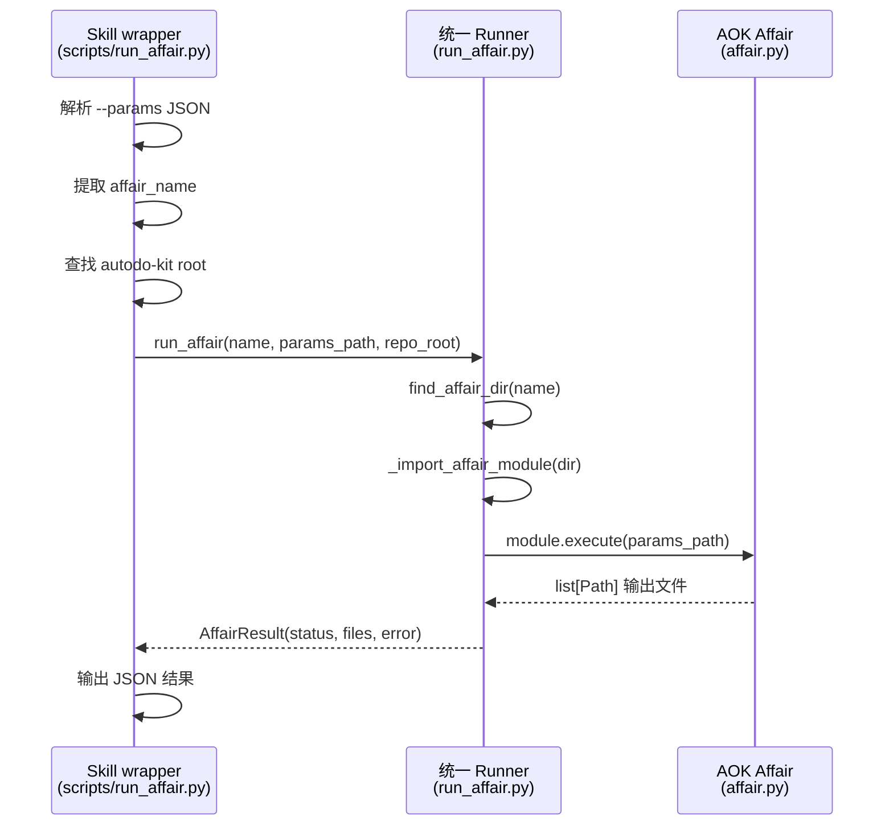

# AOK 统一事务 Runner 设计文档

## 概述

`run_affair.py` 是 autodo-kit 中统一的 AOK 事务调用入口，为 Copilot Skill 提供标准化的 `affair → execute()` 调用链路。

## 设计动机

### 问题

在审计 Copilot Skill 资产时发现：

1. 部分 Skill 的 `scripts/` 为空或缺失，无法被 Agent 调用。
2. 部分 Skill 的脚本中包含业务逻辑，与 AOK affair 中的实现重复。
3. 缺少统一的参数模板，Agent 需要临时拼参数。
4. 每个 Skill 各自发明调用方式，换设备后难以排查。

### 解决方案

提供一个统一的 `run_affair` 函数和 CLI，使所有业务型 Skill 共享同一套调用模式：

```
Skill wrapper (参数解析) → run_affair (事务查找+导入+执行) → affair.execute()
```

## 架构



## 核心 API

### `run_affair(affair_name, params_path, repo_root=None, dry_run=False) -> AffairResult`

查找并执行指定名称的 AOK 事务。

**查找策略：**
1. `affairs_root / affair_name` 精确匹配
2. 大小写不敏感匹配
3. 包含匹配（子串）

**返回结构：**
```python
@dataclass
class AffairResult:
    affair_name: str       # 事务名称
    status: str            # "PASS" | "FAIL" | "DRY_RUN"
    code: int              # 0 = 成功
    output_files: list[str]  # 输出文件路径列表
    error: str             # 错误信息
    metadata: dict         # 元数据
```

### `find_affair_dir(affair_name, repo_root) -> Path | None`

按名称查找事务目录。

## CLI 用法

```bash
# 正常执行
python -m autodokit.tools.adapters.runner.run_affair \
    --affair "生成关键词集合" \
    --params params.json

# dry-run 验证
python -m autodokit.tools.adapters.runner.run_affair \
    --affair "生成关键词集合" \
    --params params.json \
    --dry-run

# 指定 repo-root
python -m autodokit.tools.adapters.runner.run_affair \
    --affair "CNKI基础检索" \
    --params params.json \
    --repo-root /path/to/autodo-kit
```

## 与 run_capability.py 的关系

| | run_capability | run_affair |
|---|---|---|
| **调用对象** | `autodokit.tools` 工具函数 | `autodokit.affairs` 事务 |
| **标识方式** | `tool_name` (如 `bibliodb_sqlite`) | `affair_name` (如 `生成关键词集合`) |
| **参数形式** | `args` 列表 + `kwargs` 字典 | JSON 配置文件 |
| **输出** | 函数返回值 | 结构化 `AffairResult` |
| **适用层级** | 工具层（单步操作） | 事务层（多步骤编排） |

## 错误处理

| 场景 | 返回 |
|---|---|
| 无法定位 repo_root | `status=FAIL, error="无法自动定位..."` |
| 事务目录不存在 | `status=FAIL, error="未找到事务目录: ..."` |
| 参数文件不存在 | `status=FAIL, error="参数文件不存在: ..."` |
| 事务模块缺少 execute | `status=FAIL, error="事务模块缺少 execute 函数"` |
| execute 异常 | `status=FAIL, error="事务执行异常: ..."` |
| dry-run | `status=DRY_RUN, code=0` |

## 文件位置

```
autodo-kit/autodokit/tools/adapters/runner/
├── __init__.py         # 导出 run_affair, AffairResult, run_capability_main
├── run_affair.py       # 统一事务 runner
└── run_capability.py   # 统一工具 runner
```

## Skill wrapper 模板

参见 `autodo-lib/libs/templates/skill_aok_wrapper/`。
